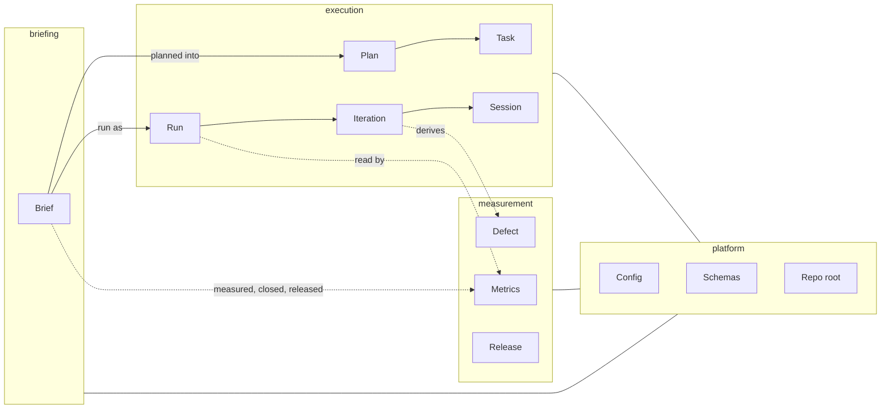

# Bounded contexts

Three contexts in the order a brief lives through them, and a platform all
three stand on.

## Ownership

| Context | Aggregate | Package | Schema | Commands |
| --- | --- | --- | --- | --- |
| briefing | Brief | `internal/brief` | — (frontmatter, checked by `brief check`) | `brief new`, `brief check`, `brief list` |
| execution | Plan, Task | `internal/state` | `state/v1` | `status`, `task …` |
| execution | Proposal, Verdict | — (written by sessions) | `proposal/v1`, `verdict/v1` | — |
| execution | Run, Iteration, Session | `internal/runs` (reads them) | `iteration/v1`, `session/v1` | `run` *(planned, B6)* |
| measurement | Metrics, line classification | `internal/metrics`, `internal/classify` | `metrics/v1` | `metrics …` |
| measurement | Defect | `internal/defect` | `defect/v1` | `defect add\|list\|set` |
| measurement | Close, snapshot | `internal/closing` | `metrics/v1` | `brief close` |
| measurement | Export, workspace | `internal/metrics` | `export/v1` | `metrics export`, `metrics --workspace` |
| platform | Config, repo root | `internal/config` | — (TOML) | `config …` |
| platform | Schemas | `internal/schema`, `schemas/` | all of the above | `schema …` |

`internal/cli` is the command tree over all of them; `cmd/vloop` is the binary
and `cmd/gendocs` generates `docs/guide/commands.md`.

## How references cross

- **Forward only, by name.** Execution refers to a brief by its path (the plan's
  `brief` field) and to a run by its run id; measurement refers to briefs by
  name and to tasks by `T<n>`. Nothing in briefing refers to execution or
  measurement — a brief does not know whether it has run, except through its
  own `status`.
- **Measurement reads, never writes, execution.** Metrics and derived defects
  are computed from run folders, commits and the plan in git; `close` writes
  only measurement's files and the brief.
- **Execution is written by the driver alone** (invariants P-2, S-2, R-1): the
  sessions write proposals and verdicts, which the driver reads.
- **The platform is shared and depends on none of them.**
