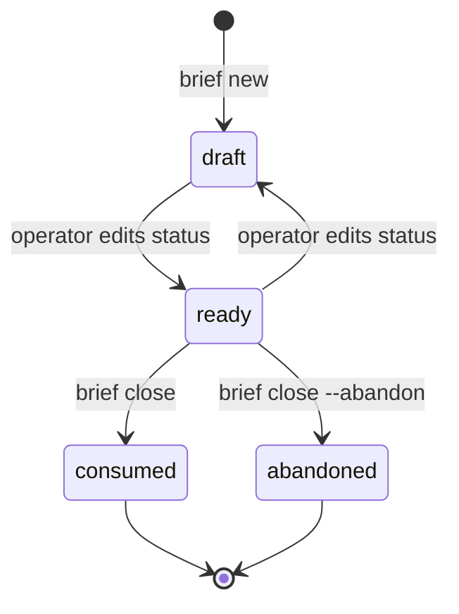

# Brief

The contract a run executes: what exists after the run that does not exist now,
pinned tightly enough that a gate can assert it, and loosely enough that the
implementation is the planner's and the work sessions'. *Part of
[briefing](briefing-context.md).*

## Identity

`docs/briefs/B<YYYYMMDD-HHMM>-<slug>.loop-brief.md`, numbered by creation time
to the minute so two people drafting on different branches never collide.

- **name**: the file name without `.md` — `B20260930-0929-vloop-close-export-workspace.loop-brief`.
- **run id**: the name without `.loop-brief` — the plan's, the journal's and the
  work branch's name.

## Frontmatter

| Key | Required | Meaning |
| --- | --- | --- |
| `name` | yes | must equal the file name without `.md` |
| `status` | yes | `draft`, `ready`, `consumed`, `abandoned` |
| `depends-on` | no | names of loop briefs that must be consumed first |
| `description`, `kind`, `created`, `seeds` | no | accepted, not checked |

Unknown keys are ignored. The shell loop also reads a body line,
`**Status:** ready to plan`; `close` keeps it in step with `status`.

## Lifecycle

- Only `ready` is checked by `brief check` and planned by the loop (B-2).
- `consumed` and `abandoned` are terminal. Re-planning a consumed brief would
  reset the plan and re-derive merged work; both the checker (its journal
  exists) and the body status line refuse it.
- An `abandoned` brief keeps its runs and metrics; briefs depending on it stay
  blocked.
- **Released** is not a status: it is detected — the first commit on the
  default branch where the brief is `consumed` (M-5).

## Sections

In the repo's language (B-3), in this order:

| `en` | `es` | Checked |
| --- | --- | --- |
| What it is | Qué es | — |
| Why this shape, and what was rejected | Por qué esta forma, y qué se descartó | — |
| Binding references | Referencias vinculantes | each entry (B-5); a missing section is a warning |
| Behaviour contract | Contrato de comportamiento | — |
| Worked example | Ejemplo trabajado | required, with a fenced block |
| Out of scope | Fuera de alcance | required, at least two items |
| Constraints | Restricciones | a missing section is a warning |
| Shape | Forma | the task estimate lives here (B-4) |

Other checks: an absolute home path is a problem; no task count, no exit or
status codes, more than two pinned internal symbols, unresolvable backticked
paths and tracker keys or links are warnings.

## Dependencies

`depends-on` makes the briefs a graph. `brief list` prints it in dependency
order: a brief is `ready` to plan when all its dependencies are `consumed`,
`blocked` otherwise, `-` once consumed itself (B-6). A dangling name or a cycle
is a problem for `brief check` and an error for `brief list`.

## Binding references

The only way a document binds a task: one entry per path, with the reason it
binds (B-5). The planner distributes them to tasks; work and review sessions
read them. There is no knowledge-roots file and no preflight scan — the brief is
the whole contract.
