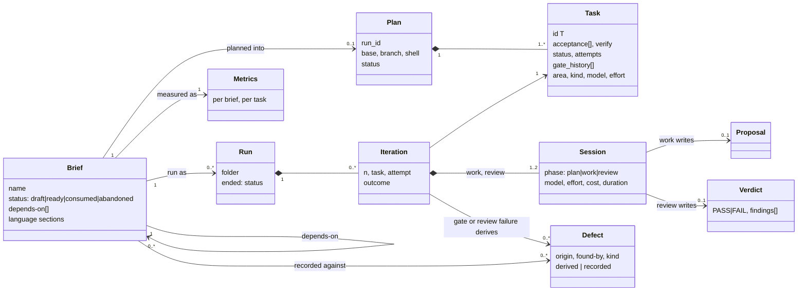

# Domain model

As built through B4. Planned parts are marked *(planned, Bn)* and listed under
[Gaps](#gaps).

## The aggregates



- A **Brief** is the only input vloop takes about a project. Everything upstream
  of it (the design act, other kinds of brief) belongs to the consumer.
- A **Plan** is a brief decomposed into **Tasks**. There is one plan per repo at
  a time, and it belongs to the branch that planned it.
- A **Run** is one invocation of the driver on a plan. A brief may take several
  (a halt and a resume). A run is a sequence of **Iterations**, each on one task:
  a work **Session**, the gate, then (if the gate passed) a review Session.
- **Defects** are either derived from iterations (a gate failure, a review
  finding) or recorded by the operator as files.
- **Metrics** are computed per brief — from its runs, its commits, its plan in
  git and its defects — never stored as the source of truth.

## Glossary

| Term | Meaning |
| --- | --- |
| **operator** | the human who writes briefs, runs the loop, verifies, closes and merges — or an interactive session acting as the operator's hands |
| **design act** | turning the operator's intent into a loop brief; upstream of vloop |
| **brief**, **loop brief** | `B<YYYYMMDD-HHMM>-<slug>.loop-brief.md`: the contract a run executes |
| **name**, **run id** | a brief's file name without `.md`; the name without `.loop-brief` |
| **plan** | the brief as tasks, in `state.json` |
| **task** | one independently verifiable unit of a plan, with its acceptance and its gate |
| **gate** | a task's `verify` command; the driver runs every done task's gate each iteration |
| **gate shell** | the shell a plan's gates are written for: `sh`, `bash`, `pwsh`, `powershell`, `cmd` |
| **attempt** | one failed try at a task; `attempts` counts them |
| **iteration** | one pass of the driver: pick a task, work, gate, review, commit |
| **run** | one driver invocation; its telemetry is a run folder |
| **session** | a fresh `claude -p` process: `plan`, `work` or `review`; sessions share nothing but files |
| **proposal** | the work session's report on its task |
| **verdict** | the review session's independent `PASS` or `FAIL`, with findings |
| **finding** | one problem a verdict names, with a kind |
| **journal** | the append-only per-brief log of iterations, one entry each |
| **driver** | the program that owns status, runs gates and commits (`.loop/run.sh`; `vloop run` *(planned, B6)*) |
| **fence** | the permission settings loop sessions run under |
| **work branch** | the branch a run happens on, named for the run id |
| **close** | recording findings, freezing metrics, writing the run record, marking the brief consumed |
| **release** | the brief's merge to the default branch |
| **snapshot** | a brief's metrics frozen at close |
| **defect** | a problem with an origin and a catcher; derived or recorded |
| **stack preset** | built-in path globs that classify a language's lines |
| **workspace** | a file listing several repos whose metrics are read together |
| **intervention** | anything the operator did around a run besides testing *(recorded as data, not yet a vloop entity)* |

## Identifiers

| Entity | Identifier | Example |
| --- | --- | --- |
| brief | name | `B20260930-0929-vloop-close-export-workspace.loop-brief` |
| plan, run, journal | run id | `B20260930-0929-vloop-close-export-workspace` |
| run folder | start time | `20260930-121245` |
| task | `T<n>`, unique in the plan | `T3` |
| session record | `NNN-<phase>` within a run folder | `003-work` |
| recorded defect | `D<YYYYMMDD-HHMM>-<slug>` | `D20260930-0809-no-gate-ran-go-mod-tidy-diff` |
| derived defect | `<run id>/i<iteration>-gate`, `…-review-<n>` | `B20260101-0900-a/i2-gate` |
| intervention | `I<YYYYMMDD-HHMM>-<slug>` | `I20260929-2224-t1-blocked-twice-on-a-gnu-only-grep-patt` |
| JSON document | `schema: <name>/v<n>` | `state/v1` |

## On disk

```
docs/briefs/<name>.md                     the briefs
.vloop/config.toml                        the repo's config
.vloop/state/state.json                   the plan            (planned, B6; the shell loop's is .loop/state/)
.vloop/state/journals/<run id>.md         the journal         (planned, B6)
.vloop/state/runs/<run id>/<folder>/      sessions/, iterations.jsonl, reports/   (planned, B6)
.vloop/state/metrics/<run id>.json        the snapshot, written by close
.vloop/defects/<id>.md                    recorded defects
.vloop/interventions/<id>.md              recorded interventions (data)
```

## Invariants

Numbered so a brief can cite one instead of restating it. **As built** unless
marked.

### Briefs — B

- **B-1** Only loop briefs are vloop's input: files named `<name>.md` with
  `<name>` = `B<YYYYMMDD-HHMM>-<slug>.loop-brief`, in `docs/briefs/`. Any other
  file there is invisible to vloop.
- **B-2** A brief's frontmatter `status` is `draft`, `ready`, `consumed` or
  `abandoned`. Only `ready` is checked and plannable; `consumed` and
  `abandoned` are terminal. A brief runs once: its journal existing means it
  has run.
- **B-3** A brief's headings come from its repo's language heading set. There is
  no cross-language fallback.
- **B-4** A rule that reads a brief reads a named section, never the whole text.
  The task estimate is the `<n> to <m> tasks` phrase (`<n> a <m> tareas`) in
  `## Shape` (`## Forma`) only.
- **B-5** A binding reference is one repo-relative path, a separator and a
  reason; it must resolve, and a cited directory must have an entry point
  (`README.md`, `index.md` or `README-*.md`).
- **B-6** `depends-on` names loop briefs, has no cycles, and a brief is ready to
  plan when every dependency is `consumed`. A cycle is reported starting from
  its lexicographically smallest name.

### Plans and tasks — P

- **P-1** One plan per repo, belonging to the branch that planned it.
- **P-2** Only the driver changes a task's or a plan's status. Sessions propose.
- **P-3** Every task has an id `T<n>` unique in the plan, a non-empty
  `acceptance` and a non-empty `verify`; `depends_on` resolves and is acyclic.
- **P-4** Gates are authored before the work they judge. Replacing one records
  the old command, a reason and who replaced it in `gate_history`.
- **P-5** A plan's gates are written for the plan's `shell`, which governs them
  from then on — not the config.
- **P-6** Model and effort for a task's session of kind `k`: the task's
  `model.k`/`effort.k`, else `VLOOP_MODEL_<K>`/`VLOOP_EFFORT_<K>`, else the
  config file, else the default.

### Sessions — S

- **S-1** A session is a fresh process; sessions share nothing but files.
- **S-2** Sessions never commit, never set status and never move git refs. The
  fence denies the commands; the driver halts (exit 9) if a ref moves anyway.
- **S-3** A work session does exactly one task. A review session judges it
  independently, from the diff and the acceptance, not from the proposal's
  summary.

### Runs — R

- **R-1** The driver makes exactly one commit per iteration, covering code,
  plan, journal and telemetry together.
- **R-2** A run happens on a work branch named for the run id, never on the
  default branch. *(Enforced by the operator today; by `vloop run`, planned B6.)*
- **R-3** A run ends with one of the driver's exit codes: 0 complete, 1
  preflight, 2 blocked, 3 stalled, 4 max iterations, 5 not converging, 6 cost
  ceiling, 7 session error, 8 repeat blocked, 9 refs moved.

### Measurement — M

- **M-1** Metrics are keyed by brief and recomputed from raw sources; sums use
  unrounded values.
- **M-2** Lines are added non-blank lines. **Delivered** is the plan's base to
  the brief's last run commit; **churn** is every task commit summed.
- **M-3** A path's category is decided by the first layer that matches:
  always-excluded (`.vloop/**`, `.loop/**`), the repo's globs, the stack
  presets, else `other`.
- **M-4** A defect has one origin (`brief`, `plan`, `work`, `env`) and one
  catcher (`gate`, `review`, `operator`, `user`). Derived defects are computed on
  every call, never stored. `found-by: user` is after release; every other
  catcher is before it.
- **M-5** A brief is released at the first commit on the default branch where it
  is `consumed`. The default branch is `origin/HEAD`'s target, else `main`, else
  `master`.
- **M-6** Closing is one commit on the work branch — defect files, the snapshot
  and the brief — with the trailer `Vloop-Brief: <name>`, after the operator has
  stated findings or `--no-findings`.
- **M-7** An export carries numbers and titles only: no file contents, no
  absolute paths, no credentials.

### Configuration — C

- **C-1** Config lives in the repo only (`.vloop/config.toml`), overridden by
  `VLOOP_<KEY>` environment variables. Nothing is global.
- **C-2** The repo root is the nearest ancestor holding `.vloop/`, else `.git`,
  else the start directory. Every path vloop prints is relative to it, with `/`.
- **C-3** Every JSON document vloop defines carries `schema: <name>/v<n>`;
  unknown keys are allowed; the schemas are embedded in the binary.
- **C-4** `language` (`en`, `es`) selects brief headings, templates and (from
  B5) the prose skills write. Keys, frontmatter, JSON, flags and vloop's own
  messages stay English.

## Gaps

- **The driver is still the shell loop.** `.vloop/state/` (plan, journals, run
  folders) is the layout `vloop run` will write *(planned, B6)*; today the plan
  and runs live in `.loop/state/`, and vloop reads them (B3).
- **R-2** is enforced by the operator until B6.
- **Gate time and configured effort** are not recorded by the shell loop; the
  metrics show them as `n/a`.
- **`area` and `kind`** exist on tasks but no planner assigns them yet
  *(planned, B5)*.
- **Interventions** are recorded as data (`.vloop/interventions/`), not yet a
  vloop entity with a command or schema.
