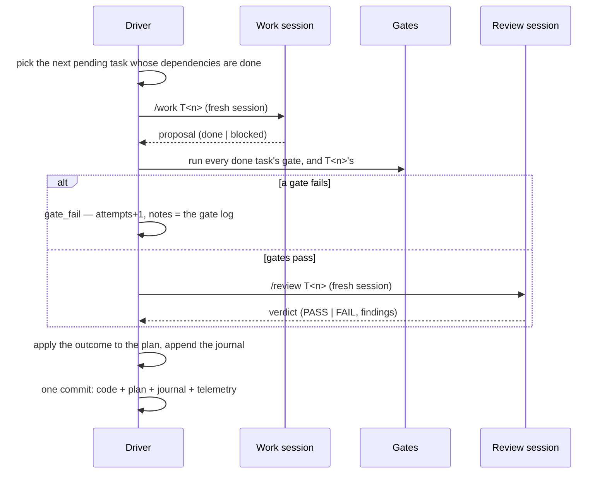

# Execution

What the loop does to a ready brief: plan it into tasks, then iterate — one task,
one work session, every done task's gate, one independent review, one commit —
until the plan is complete or the driver halts.

| Entity | Page |
| --- | --- |
| Plan | [plan.md](plan.md) |
| Task, its gate and gate history | [task.md](task.md) |
| Session — plan, work, review — with its proposal and verdict | [session.md](session.md) |
| Run and Iteration, with the driver's exit codes | [run.md](run.md) |

## One iteration

## Who writes what

- **The driver** owns every status, every gate run and every commit (P-2, R-1).
  Today the driver is the shell loop, `.loop/run.sh`; `vloop run` replaces it
  *(planned, B6)*.
- **The plan session** writes the plan once.
- **A work session** changes the working tree for its one task and writes a
  proposal. **A review session** writes a verdict. Neither commits, sets status
  or moves refs (S-2); a session that edits the plan has its edit reverted.
- **The operator** amends a plan between runs — `task verify|reset|note|drop|set`
  — never during one.

## Invariants it enforces

P-1..P-6, S-1..S-3 and R-1..R-3 in [`../domain-model.md`](../domain-model.md#invariants).

## Gaps

- The driver is the shell loop until B6: its plan lives in `.loop/state/`, its
  run records carry no gate time or configured effort, and its plan status
  strings are richer than `state/v1`'s (see [plan.md](plan.md)).
- R-2 (runs only on a work branch) is the operator's discipline until B6.
