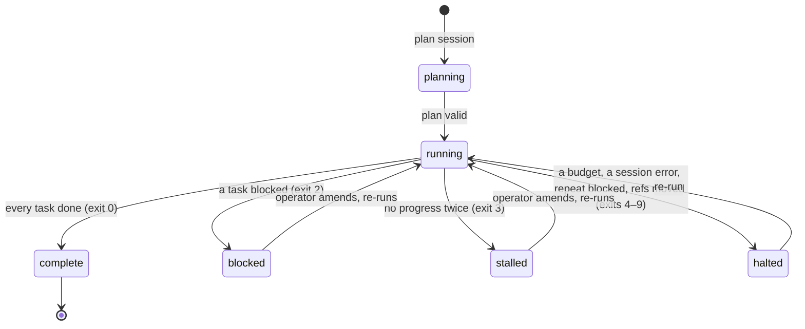

# Plan

A brief decomposed into tasks, in `state.json` (`state/v1`). *Part of
[execution](execution-context.md).*

## Fields

| Field | Meaning |
| --- | --- |
| `run_id` | the brief's run id |
| `brief` | the brief's path |
| `base` | the commit every gate compares against, pinned at planning |
| `branch` | the branch the plan belongs to (P-1) |
| `shell` | the shell its gates are written for (P-5) |
| `status` | below |
| `iteration` | iterations so far, across runs |
| `created`, `updated` | RFC 3339 UTC |
| `tasks` | the [tasks](task.md), in plan order |

## Lifecycle

`halted` covers every ending that is neither complete nor blocked nor stalled:
max iterations (4) and cost ceiling (6) are resumable as they are; not
converging (5), session error (7), repeat blocked (8) and refs moved (9) want
the operator first.

## Rules

- One plan per repo, owned by its branch; a new brief resets it (P-1). Resuming
  on another branch than the one that planned needs the brief named again.
- Only the driver changes `status` (P-2); `vloop task …` amends a plan between
  runs, validating the whole plan before writing and refusing to write an
  invalid one.
- The plan is written as 2-space-indented JSON in schema key order; loading and
  saving an unchanged plan is byte-for-byte stable.
- `status --markdown` renders the plan for humans; nothing parses that back.

## Gaps

- The shell loop writes its run's ending as the plan status verbatim
  (`max_iterations`, `session_error`, `refs_moved`…), not `halted`; `state/v1`'s
  six values are what `vloop run` writes: it stamps `run_id` (the brief's run id: its name without `.loop-brief`), `brief` and `branch`, and sets `status` `running`, then `complete`, `blocked`, `stalled` or `halted`.
