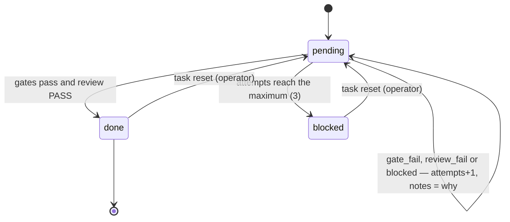

# Task

One independently verifiable unit of a [plan](plan.md). *Part of
[execution](execution-context.md).*

## Fields

| Field | Meaning |
| --- | --- |
| `id` | `T<n>`, unique in the plan (P-3) |
| `title`, `goal` | what and why |
| `kind` | `feature`, `fix`, `refactor`, `test`, `docs`, `chore` |
| `area` | one of the repo's `areas`; required only when `areas` is set |
| `references` | binding references distributed from the brief: `{path, why}` |
| `depends_on` | task ids that must be done first |
| `acceptance` | the criteria the review judges; non-empty |
| `verify` | the gate's command: one command in the plan's shell; non-empty. With the task's gate folder it is the **gate**, the planner's judge |
| `fixtures` | the stamp (a sha) of the task's gate folder, `.vloop/state/gates/<id>/`; the driver fills it, empty when the task has no folder |
| `status` | `pending`, `done`, `blocked` |
| `attempts` | failed tries so far |
| `notes` | what the next session must know; the reason for the last failure |
| `model`, `effort` | optional overrides per session kind: `{work, review}` (P-6) |
| `gate_history` | every replaced gate or fixtures: `{verify, fixtures, replaced_at, reason, by}` |

## Lifecycle

## The gate

- Written by the planner **before** the implementation (P-4), as the task's
  `verify` and, when the judge is more than one command, its gate folder
  `.vloop/state/gates/<id>/` (the gate fixtures). No task writes its judge. A
  gate that passes before the work exists proves nothing: the driver runs every
  gate on the base at acceptance and sends one that passes, or that changes the
  tree, back to the planner; the gate review then judges all of them before any
  work. `amend.sh` still warns about one.
- An oracle the gate runs is copied into a gate scratch folder
  (`run.gate-scratch`, git-ignored) and run there; the scratch folders are
  emptied after every gate, and a gate that changes the tree fails. A work
  session that edits the gate fixtures has them restored from HEAD.
- Run by the driver through one gate runner, in the plan's shell (P-5), which
  refuses an unknown shell, from the repo root, under `run.gate-timeout`; a gate
  that timed out has failed. The driver runs gates only from the plan it holds in
  memory, checked against `VLOOP_PLAN_SHA256`. Every done
  task's gate re-runs every iteration, so a later task that breaks an earlier
  one fails.
- A gate can be the defect: a work session reports `gate_dispute`, the task
  blocks, and the operator replaces the gate with `task verify <id> '<cmd>'
  --reason '<why>'`. The old command goes to `gate_history` with `by: operator`,
  and every earlier gate failure on the task becomes `origin: plan` in the
  metrics (M-4). A dispute charges no attempt. A session that rewrites a gate
  file — found by whole path token, in any OS path form, for every done task, and
  never a file a task owns — has it restored from HEAD and the iteration fails with no review; a gate
  that fails and passes on its one immediate re-run is flaky (`gate.flaky`), not
  a failed attempt. A timed-out gate is not re-run.
- The operator replaces a gate or its fixtures with `task verify <id>`, giving a
  command, a changed gate folder, or both, with `--reason`; both the old command
  and the old fixtures stamp go to `gate_history`. A change to the gate folder
  made any other way stops the run before it starts.
- Gates must run on the host's tools. On macOS that means BSD `grep`, `sed`,
  `awk`, `date` — B2 stalled on a GNU-only pattern.

## Model and effort

For the task's session of kind `k` (`work` or `review`): the task's own
override, else `VLOOP_MODEL_<K>` / `VLOOP_EFFORT_<K>`, else the config file,
else the default — `sonnet` for work and review, effort unset (P-6).
`task show` prints each with its source.

## Gaps

- `/vloop:plan` assigns `kind`, and `area` when `areas` is set; shell-loop plans
  have neither.
- The shell loop's `amend.sh verify` keeps no `gate_history`; only `vloop task
  verify` records it.
