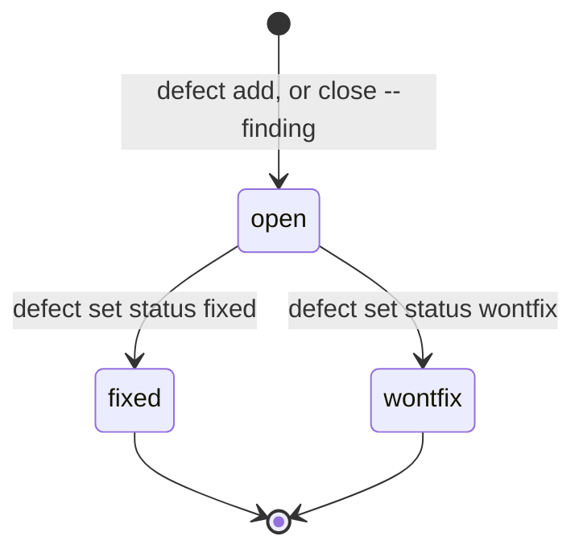

# Defect

A problem with an **origin** — where it came from — and a **catcher** — what
found it (M-4). *Part of [measurement](measurement-context.md).* The workflow:
[`docs/guide/defects.md`](../../guide/defects.md).

## The two axes

| Origin | Meaning |
| --- | --- |
| `brief` | the spec was wrong or silent (`spec-gap`) |
| `plan` | the planner's gate or task was wrong (`gate`) or too weak (`gate-gap`) |
| `work` | the implementation was wrong |
| `env` | flake, toolchain, machine |

| Catcher (`found-by`) | When |
| --- | --- |
| `gate` | during the run |
| `review` | during the run |
| `operator` | after the run, before the merge |
| `user` | after release |

**Before release** is every catcher but `user`. **Removal efficiency** = found
before release / all.

## Derived and recorded

- **Derived** from the run, computed on every call and never stored: one per
  failed gate (`origin: work`, `found-by: gate`), one per finding of a failed
  review (`found-by: review`; origin `brief` for a `spec-gap` finding, `plan`
  for a `gate-gap`, else `work`). A gate failure before the operator replaced
  that task's gate is `origin: plan`, `kind: gate`.
- **Recorded** by the operator, one file each: `.vloop/defects/<id>.md`
  (`defect/v1`), with `brief`, optional `task`, `origin`, `found-by`, `kind`
  (`bug`, `spec-gap`, `gate`, `gate-gap`, `regression`), `severity` (`low` to
  `critical`), `status`, `fixed-by` (the brief that fixed it), `case` (the
  failing test written first), `created`, then the description.

## Lifecycle of a recorded defect

## Attribution

`defect add --blame <file>:<line>` finds the brief that introduced a line: blame
on the default branch, then the commit's `Vloop-Brief:` trailer, else the loop
brief that became `consumed` in that commit. A line from no loop brief cannot be
attributed and must be given `--brief`.

## What the records say so far

Of the six recorded for B1–B3, three are `origin: brief` — spec gaps. That is
why this domain root exists: a rule stated once, and cited, cannot be restated
two ways.
